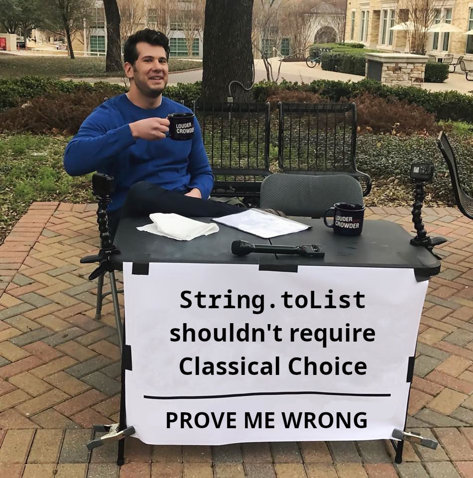

For too long we have tolerated axiom impurity. "It's not a priority." "We have finite resources." "Nobody cares." For too long, we have stood by and let this happen. But today is the day this atrocity ends. Today I am announcing **Clean** (Constructive Lean), a community fork dedicated to axiom purity.

Some say that forking an entire theorem prover over `String.toList` is "disproportionate." I say that accepting Classical Choice in basic string operations is what's disproportionate.

Roadmap:

1. Remove Classical Choice from `String.toList` — DONE ✔
2. Remove Classical Choice from `omega` when unnecessary — DONE ✔
3. Everything else — TBD
4. Cubical types — let's not get ahead of ourselves

Contributors welcome. Constructivists preferred. Classicists tolerated.

# About

Removes Classical Choice from `String.toList`.
